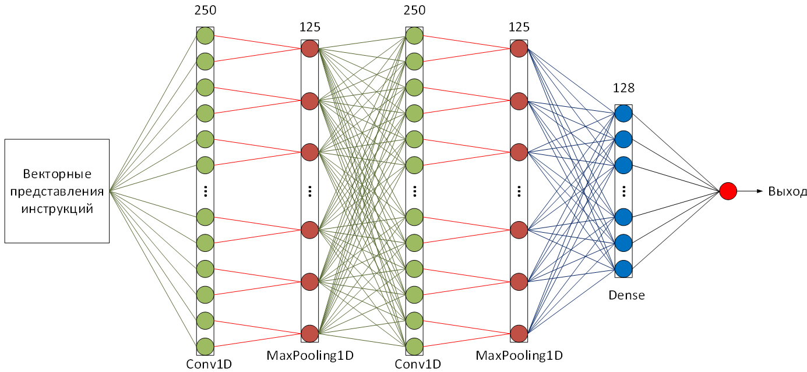

# Packed-files-Detecter
#### This program allows you to detect packed executable files.
#### The algorithm based on a convolutional neural network analyzes the instructions of the ESIL code intermediate language

## Start

python manage.py runserver 0:8000
